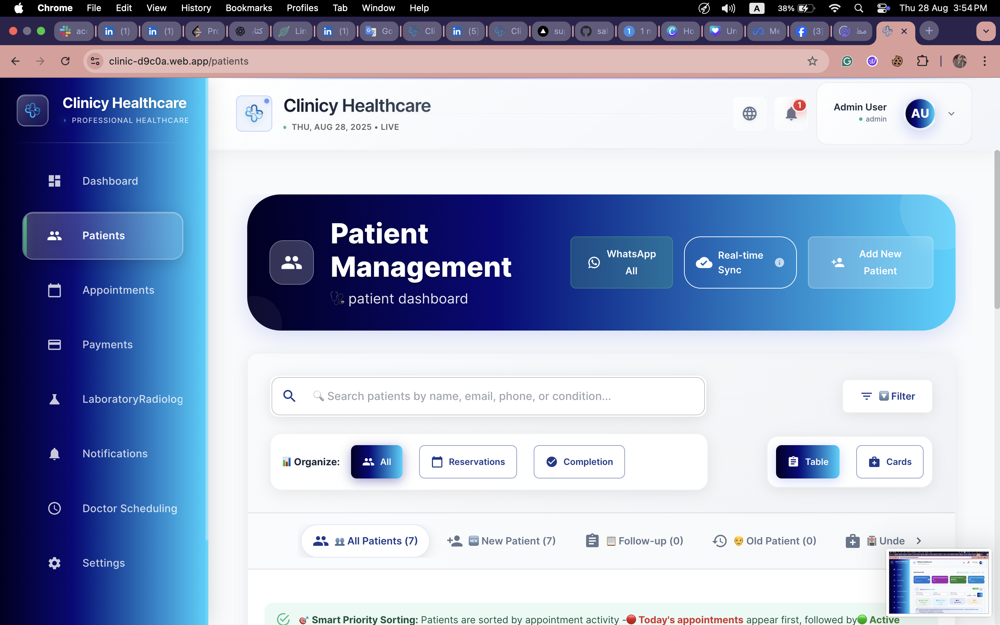
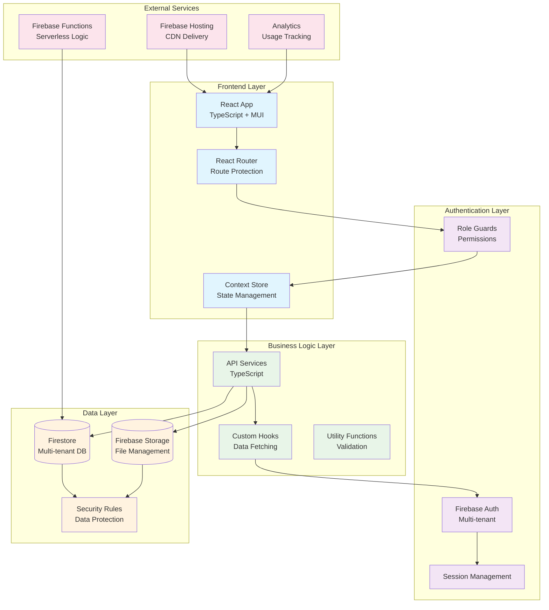
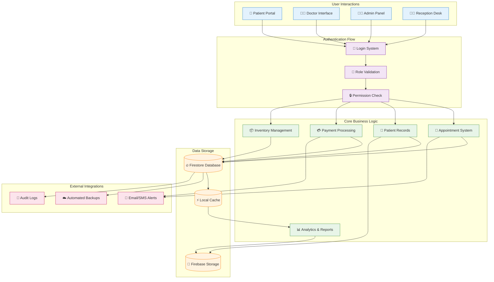
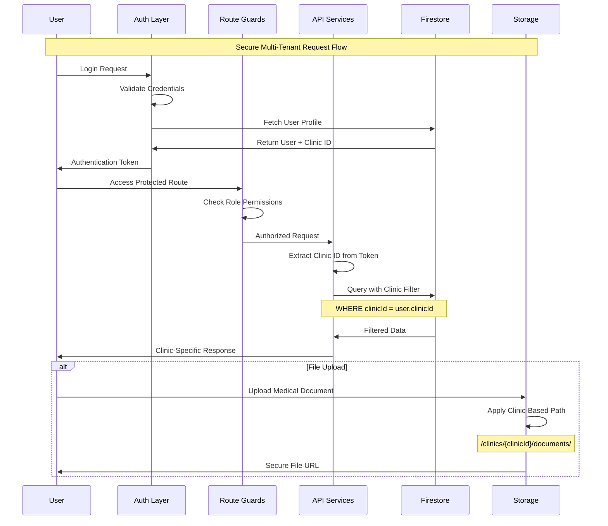

#  Clinic Management System



**What it is:** A comprehensive multi-tenant clinic management platform for healthcare providers to manage patients, appointments, payments, and medical operations.

**Who it's for:** Medical clinics, hospitals, healthcare networks, and solo practitioners who need efficient patient management and operational workflows.

**Why it's useful:** Streamlines healthcare operations with role-based access, multi-clinic support, automated scheduling, payment processing, and comprehensive reporting - reducing administrative overhead by up to 60%.

**💡 Value Proposition:** Transform your healthcare practice with a complete digital solution that handles everything from patient registration to payment processing, with enterprise-grade security and multi-language support.

---

## 🚀 Live Links

- **Demo URL "live":** (https://clinicy-health.web.app/)
- **Demo URL "dev":**(https://clinic-d9c0a.web.app/)


---

## ⚡ Quickstart

Get up and running in 3 commands:

```bash
# 1. Install dependencies
yarn install

# 2. Configure Firebase (copy firebase-config.txt to .env)
cp firebase-config.txt .env

# 3. Start development server
yarn dev
```

**Node Version Required:** `>=18.0.0` (LTS recommended)

---

## 🔧 Configuration

Create a `.env` file with these required variables:

```bash
# Firebase Configuration
VITE_FIREBASE_API_KEY=your_api_key_here
VITE_FIREBASE_AUTH_DOMAIN=your-project.firebaseapp.com
VITE_FIREBASE_PROJECT_ID=your-project-id
VITE_FIREBASE_STORAGE_BUCKET=your-project.appspot.com
VITE_FIREBASE_MESSAGING_SENDER_ID=123456789
VITE_FIREBASE_APP_ID=1:123456789:web:abcdef

# App Configuration
VITE_APP_NAME="Clinic Management System"
VITE_APP_VERSION="1.0.0"
VITE_APP_ENV=development

# Optional: Emulator Settings (Development)
VITE_USE_AUTH_EMULATOR=false
VITE_AUTH_EMULATOR_URL=http://localhost:9099
```

---

## 🏗️ Tech Stack & Architecture

### **Frontend Stack**
- **React 18** - Modern UI framework with hooks
- **TypeScript** - Type-safe development
- **Material-UI (MUI)** - Professional component library
- **TailwindCSS** - Utility-first styling
- **React Router v7** - Client-side routing
- **i18next** - Multi-language support (EN/AR)

### **Backend & Services**
- **Firebase Auth** - Authentication & user management
- **Firestore** - NoSQL database with real-time sync
- **Firebase Storage** - File uploads & medical documents
- **Firebase Functions** - Serverless backend logic
- **Firebase Hosting** - Production deployment

### **Development Tools**
- **Vite** - Fast build tool and dev server
- **ESLint** - Code linting and quality
- **PostCSS** - CSS processing and optimization

### **System Architecture**



---

## 📊 Data Flow Diagram


*Complete system data flow showing user interactions, authentication, business logic, and data storage layers with multi-tenant security.*

### **Interactive Mermaid Version**



### **Multi-Tenant Data Flow**



---

## 💻 Usage

### **Common API Operations**

#### **Patient Management**
```typescript
// Create new patient
const patient = await createPatient({
  firstName: "John",
  lastName: "Doe", 
  email: "john@example.com",
  phone: "+1234567890",
  clinicId: "clinic_123"
});

// Search patients
const results = await searchPatients({
  query: "John",
  clinicId: "clinic_123"
});
```

#### **Appointment Scheduling**
```typescript
// Book appointment
const appointment = await createAppointment({
  patientId: "patient_456",
  doctorId: "doctor_789", 
  date: "2024-01-15",
  time: "10:00",
  type: "consultation"
});

// Get doctor availability
const slots = await getDoctorAvailability({
  doctorId: "doctor_789",
  date: "2024-01-15"
});
```

#### **Payment Processing**
```typescript
// Process payment
const payment = await processPayment({
  patientId: "patient_456",
  amount: 150.00,
  method: "card",
  description: "Consultation fee"
});

// Generate invoice
const invoice = await generateInvoice({
  paymentId: "payment_123"
});
```

### **Key Features**

🏥 **Multi-Clinic Support** - Isolated data for each clinic with subscription tiers
👥 **Role-Based Access** - Management, Doctor, Receptionist with custom permissions  
📅 **Smart Scheduling** - Automated appointment booking with conflict detection
💳 **Payment Integration** - Complete billing and payment processing system
📊 **Advanced Analytics** - Real-time dashboards and comprehensive reporting
🌍 **Multi-Language** - Full RTL support for Arabic and English
📱 **Responsive Design** - Works seamlessly on desktop, tablet, and mobile
🔒 **Enterprise Security** - HIPAA-compliant data protection and audit trails

---

## 🧪 Quality & Testing

[]()
[]()
[]()
[]()

### **Quality Tools**
```bash
# Run linting
yarn lint

# Run type checking  
yarn type-check

# Run tests (when implemented)
yarn test

# Build for production
yarn build

# Preview production build
yarn preview
```

### **Firebase Deployment**
```bash
# Deploy hosting only
yarn deploy:hosting

# Deploy Firestore rules
yarn deploy:rules  

# Full deployment
yarn deploy:full
```

---

## 🤝 Contributing

We welcome contributions! Please follow these guidelines:

### **Development Workflow**
1. Fork the repository
2. Create feature branch: `feature/amazing-feature`
3. Make your changes with tests
4. Run quality checks: `yarn lint && yarn type-check`
5. Submit pull request with clear description

### **Branch Naming Convention**
- `feature/feature-name` - New features
- `bugfix/bug-description` - Bug fixes  
- `docs/update-readme` - Documentation updates
- `refactor/component-name` - Code refactoring

### **Commit Style**
Follow [Conventional Commits](https://conventionalcommits.org/):
```bash
feat: add patient search functionality
fix: resolve appointment booking conflict
docs: update API documentation  
refactor: optimize database queries
```


---

## 🚫 When NOT to Use This System

- **Single-doctor practices** with < 50 patients (consider simpler solutions)
- **Specialized medical fields** requiring custom workflows not covered
- **Organizations** requiring on-premise deployment only
- **Basic appointment booking** without patient management needs


