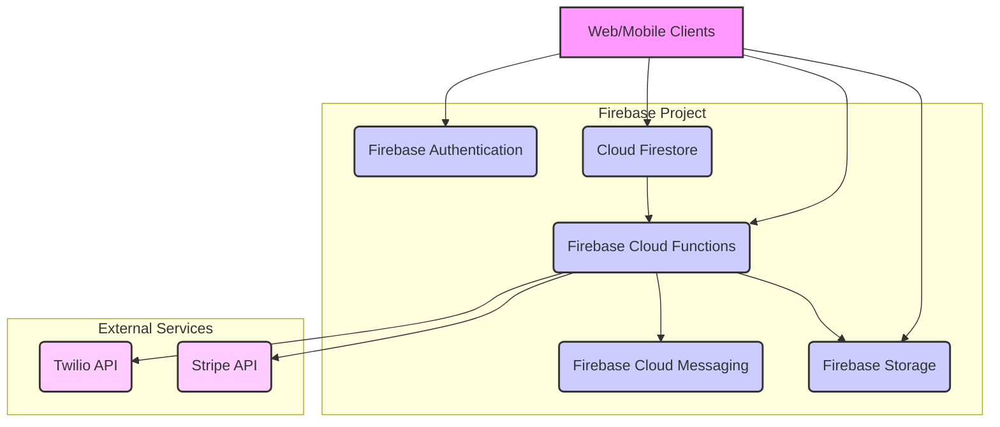

# Multi-Clinic Management System: Database Schema and System Architecture

## 1. Introduction

This document outlines the proposed database schema and system architecture for the multi-clinic management system, leveraging Firebase as the backend-as-a-service (BaaS). The design prioritizes multi-tenancy, ensuring data isolation and secure access control for each clinic. The system will be built with scalability and maintainability in mind, aligning with the features and technical stack detailed in the provided roadmap.

## 2. Database Schema: Cloud Firestore

Cloud Firestore will serve as the primary database, chosen for its flexible document model, real-time capabilities, and robust querying features. The multi-tenancy will be implemented using 'Approach A: Collection per Tenant', where each clinic's data resides within its own dedicated subcollections. This approach provides clear data separation and simplifies the application of security rules.

### 2.1. Core Collections and Document Structure

The top-level collection will be `clinics`, with each document representing a unique clinic (tenant). Under each `clinicId` document, various subcollections will store the clinic-specific data. This hierarchical structure ensures that all data for a given clinic is encapsulated within its own subtree.

#### 2.1.1. `clinics` Collection

- **Path:** `clinics/{clinicId}`
- **Purpose:** Stores general information about each clinic.
- **Fields:**
    - `name` (string): The name of the clinic.
    - `address` (string): The physical address of the clinic.
    - `phone` (string): Contact phone number for the clinic.
    - `email` (string): Contact email for the clinic.
    - `createdAt` (timestamp): Timestamp of clinic creation.
    - `updatedAt` (timestamp): Timestamp of last update.
    - `ownerUid` (string): Firebase Authentication UID of the clinic owner (Admin role).
    - `branches` (subcollection): Contains documents for each branch within the clinic.
    - `users` (subcollection): Contains documents for staff users belonging to this clinic.
    - `patients` (subcollection): Contains documents for patients registered with this clinic.
    - `appointments` (subcollection): Contains documents for appointments scheduled within this clinic.
    - `inventory` (subcollection): Contains documents for inventory items specific to this clinic.
    - `chats` (subcollection): Contains documents for internal chat messages within this clinic.

#### 2.1.2. `branches` Subcollection

- **Path:** `clinics/{clinicId}/branches/{branchId}`
- **Purpose:** Stores information about each branch or location of a clinic.
- **Fields:**
    - `name` (string): Name of the branch.
    - `address` (string): Address of the branch.
    - `phone` (string): Contact phone number for the branch.
    - `email` (string): Contact email for the branch.
    - `createdAt` (timestamp): Timestamp of branch creation.
    - `updatedAt` (timestamp): Timestamp of last update.

#### 2.1.3. `users` Subcollection

- **Path:** `clinics/{clinicId}/users/{userId}`
- **Purpose:** Stores profiles and roles for staff users (Admin, Doctor, Receptionist) within a specific clinic. The `userId` will correspond to the Firebase Authentication UID.
- **Fields:**
    - `uid` (string): Firebase Authentication User ID.
    - `email` (string): User's email address.
    - `displayName` (string): User's full name.
    - `role` (string): User's role (e.g., 'admin', 'doctor', 'receptionist').
    - `branchId` (string, optional): ID of the branch the user primarily works at (if applicable).
    - `createdAt` (timestamp): Timestamp of user creation.
    - `updatedAt` (timestamp): Timestamp of last update.
    - `isActive` (boolean): Indicates if the user account is active.

#### 2.1.4. `patients` Subcollection

- **Path:** `clinics/{clinicId}/patients/{patientId}`
- **Purpose:** Stores patient profiles and medical history.
- **Fields:**
    - `firstName` (string): Patient's first name.
    - `lastName` (string): Patient's last name.
    - `dateOfBirth` (timestamp): Patient's date of birth.
    - `gender` (string): Patient's gender.
    - `contactNumber` (string): Patient's phone number.
    - `email` (string): Patient's email address.
    - `address` (string): Patient's address.
    - `medicalHistory` (map/object): Stores key-value pairs for medical history notes, conditions, etc.
    - `allergies` (array of strings): List of patient allergies.
    - `createdAt` (timestamp): Timestamp of patient record creation.
    - `updatedAt` (timestamp): Timestamp of last update.
    - `assignedDoctorId` (string, optional): UID of the doctor primarily assigned to this patient.

#### 2.1.5. `appointments` Subcollection

- **Path:** `clinics/{clinicId}/appointments/{appointmentId}`
- **Purpose:** Manages patient appointments, including scheduling, reminders, and status.
- **Fields:**
    - `patientId` (string): Reference to the `patientId` in the `patients` subcollection.
    - `doctorId` (string): Reference to the `userId` of the doctor for this appointment.
    - `branchId` (string): Reference to the `branchId` where the appointment takes place.
    - `startTime` (timestamp): Start time of the appointment.
    - `endTime` (timestamp): End time of the appointment.
    - `status` (string): Current status of the appointment (e.g., 'scheduled', 'confirmed', 'completed', 'cancelled').
    - `type` (string): Type of appointment (e.g., 'consultation', 'follow-up', 'check-up').
    - `notes` (string, optional): Any specific notes for the appointment.
    - `reminderSent` (boolean): Flag to indicate if a reminder has been sent.
    - `createdAt` (timestamp): Timestamp of appointment creation.
    - `updatedAt` (timestamp): Timestamp of last update.

#### 2.1.6. `inventory` Subcollection

- **Path:** `clinics/{clinicId}/inventory/{itemId}`
- **Purpose:** Tracks clinic inventory of medications, supplies, or products.
- **Fields:**
    - `name` (string): Name of the inventory item.
    - `description` (string, optional): Description of the item.
    - `sku` (string): Stock Keeping Unit (unique identifier).
    - `currentStock` (number): Current quantity in stock.
    - `minStockLevel` (number): Minimum stock level for alerts.
    - `unit` (string): Unit of measurement (e.g., 'pcs', 'ml', 'box').
    - `expirationDate` (timestamp, optional): Expiration date of the item.
    - `price` (number): Purchase or selling price of the item.
    - `branchId` (string, optional): If inventory is branch-specific, reference to `branchId`.
    - `createdAt` (timestamp): Timestamp of item creation.
    - `updatedAt` (timestamp): Timestamp of last update.

#### 2.1.7. `chats` Subcollection

- **Path:** `clinics/{clinicId}/chats/{chatId}`
- **Purpose:** Stores internal chat messages between staff members within a clinic.
- **Fields:**
    - `participants` (array of strings): Array of `userId`s participating in the chat.
    - `lastMessage` (string, optional): Content of the last message.
    - `lastMessageAt` (timestamp, optional): Timestamp of the last message.
    - `createdAt` (timestamp): Timestamp of chat creation.
    - `updatedAt` (timestamp): Timestamp of last update.
    - `messages` (subcollection): Contains individual messages within the chat.

#### 2.1.8. `messages` Subcollection (under `chats`)

- **Path:** `clinics/{clinicId}/chats/{chatId}/messages/{messageId}`
- **Purpose:** Stores individual chat messages.
- **Fields:**
    - `senderId` (string): `userId` of the sender.
    - `content` (string): The message content.
    - `timestamp` (timestamp): Timestamp when the message was sent.
    - `readBy` (array of strings, optional): Array of `userId`s who have read the message.

## 3. System Architecture: Firebase Ecosystem

The system will be built entirely on the Firebase ecosystem, providing a serverless and scalable architecture. This approach significantly reduces development overhead for backend infrastructure and allows for rapid feature delivery.

### 3.1. Firebase Authentication

Firebase Authentication will handle all user authentication and identity management. It will be configured to support multi-tenancy, ensuring that users are associated with a specific clinic.

- **User Management:** Email/password authentication will be the primary method. OAuth providers can be added in the future if required.
- **Role-Based Access Control (RBAC):** User roles (Admin, Doctor, Receptionist) will be managed using Firebase Custom Claims. Upon user creation or role assignment, a Cloud Function will set custom claims (`clinicId` and `role`) on the user's JWT token. This allows Firestore Security Rules to efficiently enforce access permissions based on the user's clinic and role.

### 3.2. Cloud Firestore (as detailed in Section 2)

### 3.3. Firebase Cloud Functions

Cloud Functions will serve as the serverless backend logic, executing code in response to events triggered by Firebase features (e.g., Firestore writes, Auth events) or HTTPS requests. All backend logic will be written in TypeScript for consistency with the frontend.

- **Key Use Cases:**
    - **Notifications:** Triggering SMS reminders via Twilio and push notifications via FCM for appointments or other events.
    - **Payments:** Securely interacting with the Stripe API for payment processing, keeping sensitive API keys off the client-side.
    - **Data Processing:** Performing aggregate queries for analytics reports or complex data manipulations.
    - **User Management:** Setting custom claims for new users or updating user roles.
    - **Inventory Decrement:** Automatically decrementing inventory items when a treatment is performed or an item is dispensed.

### 3.4. Firebase Storage

Firebase Storage will be used for storing binary files such as patient documents (e.g., lab reports, images), clinic assets, or any other files attached to records. Security rules will be implemented to ensure only authorized users can access specific files.

### 3.5. Firebase Cloud Messaging (FCM)

FCM will be integrated for delivering push notifications to mobile devices (and potentially web push notifications). Cloud Functions will trigger FCM messages for appointment reminders, chat messages, or other relevant alerts.

### 3.6. Third-Party Integrations

- **Twilio:** For sending SMS and WhatsApp messages (e.g., appointment reminders, marketing campaigns). Integration will be via Firebase Cloud Functions or a Twilio Firebase Extension.
- **Stripe:** For processing online payments. Stripe API calls will be handled securely through Firebase Cloud Functions.

### 3.7. Frontend Architecture (Web and Mobile)

- **Web Application:** A Single-Page Application (SPA) built with React (18+) and TypeScript. It will utilize a UI component library (e.g., Material-UI or Ant Design) for a modern and responsive user interface. React Router will manage client-side navigation.
- **Mobile Application:** The mobile app will reuse the web codebase by wrapping the React web app into native containers for iOS/Android using tools like Concula or Ionic Capacitor. This approach ensures code consistency and faster development while providing a native-like experience. Responsive design and touch-friendly components will be prioritized.

### 3.8. Development and DevOps

- **Version Control:** Git will be used for source code management.
- **Hosting:** Firebase Hosting will be used for deploying the web application, providing a global CDN and SSL by default.
- **CI/CD:** A Continuous Integration/Continuous Deployment (CI/CD) pipeline (e.g., GitHub Actions) will automate testing and deployments for both web and mobile applications.

## 4. Multi-Tenancy Implementation Details

As previously stated, 'Approach A: Collection per Tenant' will be the chosen strategy for data isolation. This means:

- Every clinic will have its own dedicated set of subcollections under its `clinicId` document in the `clinics` collection.
- All queries and data manipulations will explicitly include the `clinicId` in the path to ensure data is scoped to the correct tenant.
- Firebase Security Rules will be rigorously defined to enforce that users can only access data within their assigned `clinicId` and based on their `role`.

## 5. High-Level System Architecture Diagram

## 6. Conclusion

This detailed database schema and system architecture, built upon the Firebase ecosystem, provides a robust and scalable foundation for the multi-clinic management system. The multi-tenancy approach, coupled with strong security rules and serverless functions, will enable efficient development and secure operation of the application. The next phase will involve setting up the development environment and project structure based on this design.

